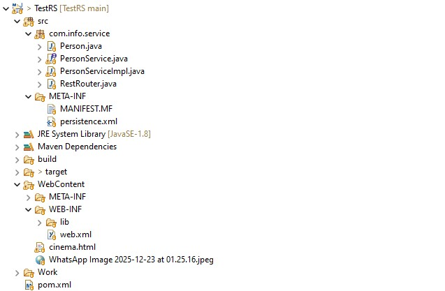
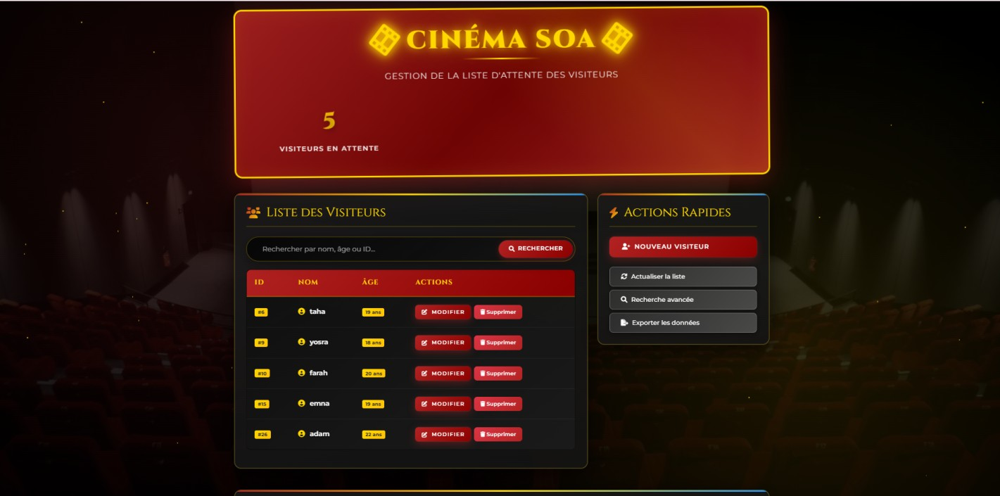
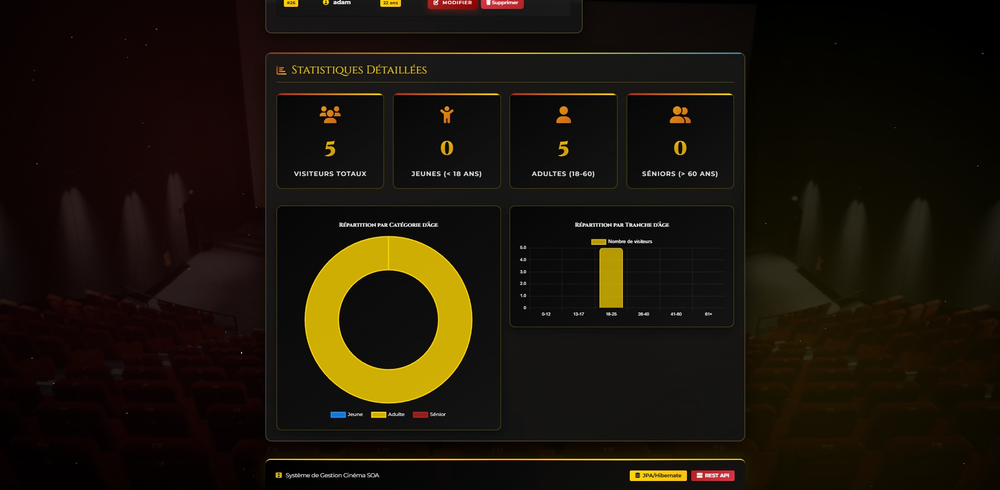

# 🎬 CINÉMA SOA – Système de Gestion des Visiteurs

## 📋 Description du Projet

**CINÉMA SOA** est une application web permettant la gestion d’une **liste d’attente de visiteurs pour un cinéma**.  
Le projet repose sur une architecture **Client / Serveur REST** où :

- Le **frontend** fournit une interface utilisateur moderne, interactive et responsive.
- Le **backend** expose des services RESTful développés en **JEE / JAX-RS**, avec **JPA / Hibernate** pour la persistance des données.

Ce projet a été réalisé dans le cadre du **cours de développement JEE**, afin de démontrer l’intégration complète d’une architecture REST avec une interface web dynamique.

---

## ✨ Fonctionnalités Principales

- ✅ Affichage dynamique de la liste des visiteurs (tableau)
- ✅ Ajout de visiteurs avec formulaire et validation des champs
- ✅ Modification des visiteurs avec pré-remplissage automatique
- ✅ Suppression avec modal de confirmation personnalisé
- ✅ Recherche avancée par **ID, nom ou âge**
- ✅ Statistiques en temps réel avec compteurs dynamiques
- ✅ Graphiques interactifs (catégories et tranches d’âge)
- ✅ Export des données au format **JSON**
- ✅ Interface **responsive** (mobile, tablette, desktop)
- ✅ Animations et effets visuels (particules, transitions)

---

## 🛠️ Technologies Utilisées

### 🎨 Frontend
- **HTML5** – Structure de l’application
- **CSS3** – Stylisation avancée (gradients, animations, effets)
- **JavaScript ES6+** – Logique métier et interactions asynchrones
- **Bootstrap 5.1.3** – Framework CSS responsive
- **Font Awesome 6.0** – Icônes
- **Chart.js 3.x** – Graphiques interactifs (Doughnut & Bar)
- **Fetch API** – Consommation des services REST
- **Google Fonts** – Cinzel & Montserrat

### ⚙️ Backend
- **JEE / JAX-RS (Jersey)** – Services REST
- **JPA / Hibernate 5.2.6** – ORM et persistance des données
- **Jersey 2.35** – Implémentation JAX-RS
- **MySQL 5.x / 6.x** – Base de données relationnelle
- **Apache Tomcat 8.5+** – Serveur d’application
- **Maven** – Gestion des dépendances


---

---
### Interface utilisateur

* Tableau dynamique des personnes
* Formulaires avec validation des champs
* Messages visuels (succès / erreur)
* Interface **responsive** grâce à Bootstrap



---
## 💻 Fonctionnalités Détaillées

### 1️⃣ Liste des Visiteurs – `GET /affiche`

- Affichage sous forme de tableau : **ID, Nom, Âge, Actions**
- Badge coloré selon la catégorie d’âge :
  - 🔵 **Jeune** : < 18 ans  
  - 🟡 **Adulte** : 18 – 60 ans  
  - 🔴 **Sénior** : > 60 ans
- Compteurs dynamiques en temps réel
- Message d’état vide avec bouton d’ajout

---

### 2️⃣ Ajouter un Visiteur – `POST /add/{age}/{name}`

- Formulaire modal avec :
  - Nom (minimum 2 caractères)
  - Âge (1 à 120 ans)
- Validation en temps réel
- Prévisualisation de la catégorie d’âge
- Messages d’erreur explicites
- Notification de succès
- Fermeture automatique du modal

---

### 3️⃣ Modifier un Visiteur – `PUT /update/{id}/{age}/{name}`

- Récupération automatique via `GET /getid/{id}`
- Pré-remplissage du formulaire
- Validation identique à l’ajout
- Mise à jour immédiate de la liste
- Prévisualisation de la nouvelle catégorie

---

### 4️⃣ Supprimer un Visiteur – `DELETE /remove/{id}`

- Modal de confirmation personnalisé
- Affichage du nom du visiteur
- Avertissement d’irréversibilité
- Double confirmation (Annuler / Supprimer)
- Notification après suppression
- Mise à jour automatique des statistiques

---

### 5️⃣ Recherche Avancée

#### 🔍 Recherche instantanée
- Filtrage en temps réel pendant la saisie
- Recherche par **ID, nom ou âge**

#### 🔎 Recherche avancée (modal)
- Par ID → `GET /getid/{id}`
- Par nom → `GET /getname/{name}`
- Par âge → Filtrage local
- Affichage sous forme de cartes détaillées
- Gestion du cas « aucun résultat »

---

### 6️⃣ Statistiques & Graphiques

#### 📊 Compteurs dynamiques
- Total des visiteurs
- Jeunes (< 18 ans)
- Adultes (18 – 60 ans)
- Séniors (> 60 ans)

#### 📈 Graphique 1 – Répartition par Catégorie
- Doughnut Chart
- Couleurs thématiques (bleu / or / rouge)
- Animations et légende interactive

#### 📉 Graphique 2 – Tranches d’Âge
- Bar Chart horizontal
- Tranches : 0-12, 13-17, 18-25, 26-40, 41-60, 61+
- Animation de chargement
- Tooltips interactifs

---

### 7️⃣ Fonctionnalités Supplémentaires

- 📥 Export des données en **JSON**
- 📱 Interface totalement responsive
- 🎥 Thème visuel cinéma (or & rouge)
- ✨ Particules animées en arrière-plan
- 🔔 Notifications toast (succès, erreur, info)
- 🎞️ Animations fluides et transitions modernes
---
## Architecture du projet

```text
Frontend (HTML / CSS / JavaScript)
        |
        | HTTP (JSON)
        v
Backend REST (JAX-RS)
        |
        v
Base de données
```
### 📌 Endpoints REST

| Méthode HTTP | Endpoint | Description | Réponse |
|--------------|----------|-------------|---------|
| GET | `/affiche` | Récupérer tous les visiteurs | `{ state: "ok", data: [Person] }` |
| POST | `/add/{age}/{name}` | Ajouter un visiteur | `{ state: "ok", user: Person }` |
| PUT | `/update/{id}/{age}/{name}` | Modifier un visiteur | `{ state: "ok" }` |
| DELETE | `/remove/{id}` | Supprimer un visiteur | `{ state: "ok" }` |
| GET | `/getid/{id}` | Recherche par ID | `{ state: "ok", data: Person }` |
| GET | `/getname/{name}` | Recherche par nom | `{ state: "ok", data: [Person] }` |

---
### 2️⃣ Lancer le frontend

Deux méthodes sont possibles :

#### Méthode 1 : via navigateur

* Ouvrir directement le fichier `cinema.html`

#### Méthode 2 : via Tomcat

* Placer le fichier `cinema.html` dans le dossier web de Tomcat
* Accéder à l’URL :

  ```
  http://localhost:8081/TestRS/cinema.html
  ```

---

## Vidéo de démonstration

Lien drive :

```
https://youtu.be/XXXXXXXX a changeeee***
```

---

## Dépôt GitHub

Lien du projet :

```
https://github.com/mariem53/Projet-SOA-CIN-MA-SOA.git
```

---

## Auteurs
* **Mariem Baccouch** (Groupe TP 6)
* **Yosra Regaieg** (Groupe TP 7)
* **Module** : SOA
* **Année universitaire** : 2025 / 2026

---
